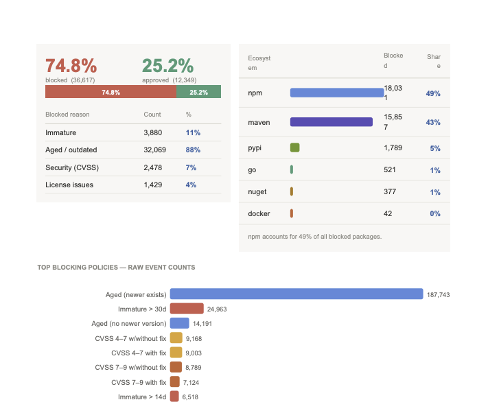

# OSS Supply Chain Risk Report Agent

Generates a fully-formatted PDF risk report from one or more JFrog Curation analysis tarballs.

## Usage

**Single tarball:**
```bash
python3 oss_risk_agent.py ACME_curation_analysis.tar.gz
python3 oss_risk_agent.py ACME_curation_analysis.tar.gz --output /tmp/report.pdf
```

**Aggregated report from multiple tarballs (same organisation, different regions):**
```bash
python3 oss_risk_agent.py EU.tar.gz LATAM.tar.gz MEXUS.tar.gz \
    --customer-name "Santander" --output /tmp/santander_global.pdf
```

## Flags

| Flag | Short | Description |
|------|-------|-------------|
| `--output` | `-o` | Output PDF path |
| `--customer-name` | `-n` | Override the customer display name |

## Installation

```bash
pip install -r requirements.txt
```

## Input Format

The agent expects tarballs (`.tar.gz`) containing a customer directory with:
- `analysis_summary.txt` — key:value metadata
- `blocked_packages.csv` — packages blocked by curation policies
- `blocked_packages_v2.csv` — enriched blocked package events
- `approved_packages.csv` — packages that passed curation
- `unmatched_urls.csv` — URLs that couldn't be matched (optional)

## Sample Output



## Output

A PDF report covering:
- Executive summary with block/approve rates
- Breakdown by risk category (malicious, immature, critical CVE, EOL, etc.)
- Ecosystem breakdown
- Top blocking policies
- Package-level detail tables
